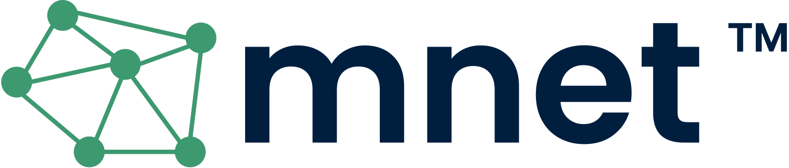

# Mnet
**The Mnet off-grid communication project** [Report a bug](https://github.com/joba14/mnet/issues/new) · [Request a feature](https://github.com/joba14/mnet/issues/new)

## Table of Contents
- [Overview](#overview)
- [Features](#features)
- [Hardware Requirements](#hardware-requirements)
- [Documentation](#documentation)
- [License](#license)
- [Contribution Guidelines](#contribution-guidelines)
- [Acknowledgments](#acknowledgments)
- [Trademarks](#trademarks)

## Overview
The Mnet project is an off-grid communication project that establishes a mesh network using LoRa modules and STM32 boards. The implementation spans the first four layers of the OSI networking model, providing features like virtual addressing, self-routing, and efficient packet handling.

[(to the top)](#mnet)

## Features
- **LoRa Communication:** Long-range, low-power wireless communication.
- **Virtual Addressing:** Nodes are identified using virtual addresses, similar to IP addresses.
- **Self-Routing:** Nodes determine the optimal path for packet transmission.
- **Packet Handling:** Efficient packet construction, defragmentation, and reconstruction.

[(to the top)](#mnet)

## Hardware Requirements
- STM32 (Bluepill) Development Boards
- LoRa Modules (compatible with STM32)
- Additional hardware as needed (sensors, power supply, etc.)

[(to the top)](#mnet)

## Documentation
For detailed information on architecture, API, and usage, refer to the [documentation](docs/readme.md) readme file.

[(to the top)](#mnet)

## License
TODO: This project is licensed under the <UNKNOWN> license. Users and contributors are required to review and comply with the license terms specified in the [license.md file](./license.md). The license outlines the permitted usage, distribution, and intellectual property rights associated with the Mnet project.

[(to the top)](#mnet)

## Contribution Guidelines
Please read [contributing.md](./contributing.md) for details on the code of conduct, and the process for submitting pull requests.

[(to the top)](#mnet)

## Acknowledgments
TODO: Mention any contributors, libraries, or tools that influenced or supported your project.

[(to the top)](#mnet)

## Trademarks
All logos, images, and other content related to the mnet project are owned by the project and its contributors. Any unauthorized use or reproduction of these materials without explicit permission and without following the terms in the project license is prohibited.

[(to the top)](#mnet)
